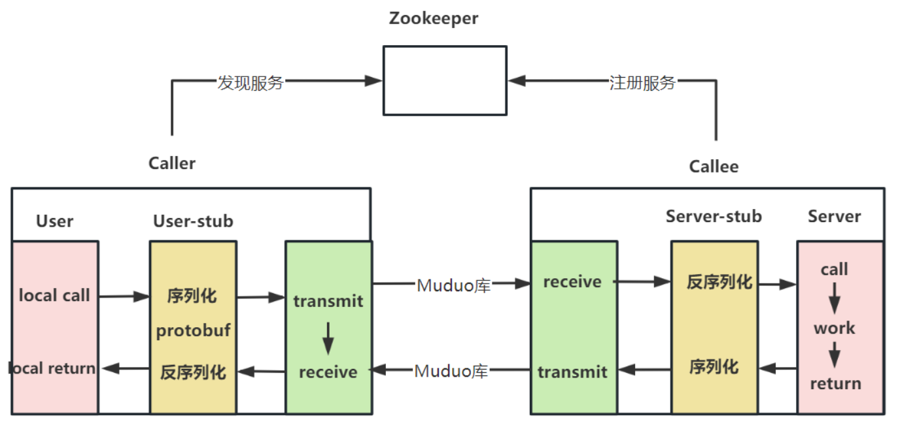
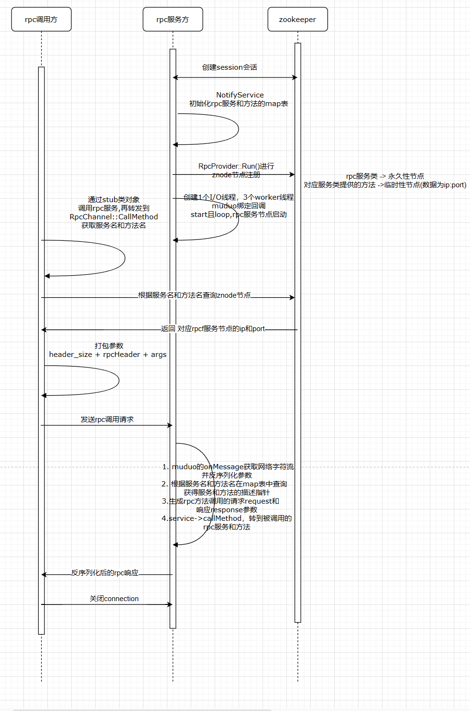
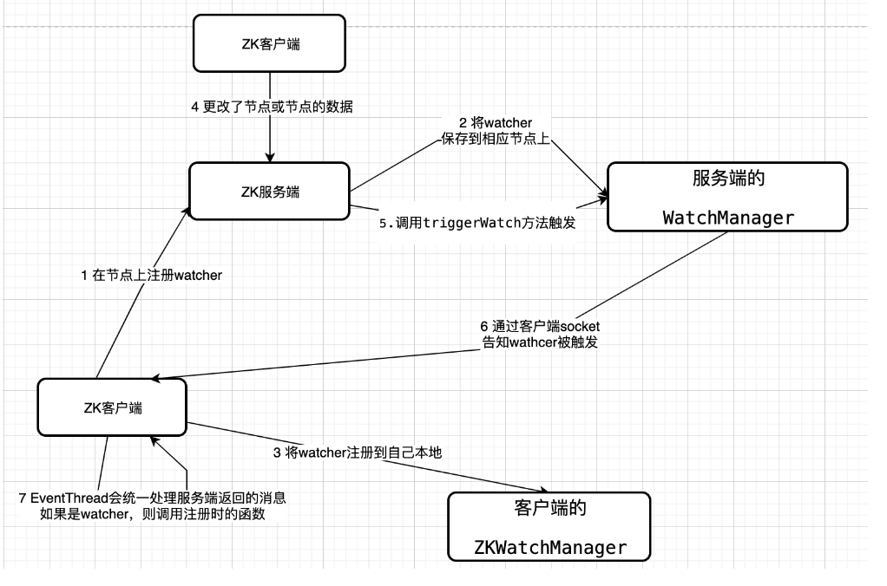

## 项目环境

+ CMake 3.12.4
+ GCC 8.3.1 (Red Hat 8.3.1-3)
+ Protobuf 3.11.2
+ Zookeepeer 3.4.10
+ muduo 网络库

## 技术栈

1. 集群和分布式的原理和概念
2. RPC 远程过程调用的原理及实现
3. Protobuf 数据序列化与反序列化
4. Zookeeper 分布式一致性协调服务应用及编程
5. muduo 网络库编程
6. 基于异步日志缓冲队列实现日志系统
7. CMake 构建项目集成编译环境
8. 基于shell 脚本实现一键编译

## RPC通信原理

RPC（Remote Procedure Call Protocol）远程过程调用协议。

通俗的描述是：客户端在不知道调用细节的情况下，调用存在于远程计算上的某个过程或函数，就像调用本地应用程序中的一样。

正式的描述是：一种通过网络从远程计算机程序上请求服务，而不需要了解底层网络技术的协议。

实现 RPC 的程序包括 5 个部分：User、User-stub、RPCRuntime、Server-stub、Server。

user 就是发起 RPC 调用的 client ，当 user 想发起一个远程调用时，它实际是通过本地调用 user-stub。 user-stub 负责将调用的接口、方法和参数通过约定的协议规范进行编码并通过本地的 RPCRuntime 实例传输到远端的实例。远端 RPCRuntim 实例收到请求后交给 server-stub 进行解码后发起本地端调用，调用结果再返回给 user 端。

## 项目整体流程

## 分布式系统存在的问题

**服务的动态注册和实现**,不同的rpc服务节点(ip和port不同)提供不同的服务,客户端想要调用某个rpc服务节点提供的服务则必须知道该节点的ip和port;若只是简单的将rpc服务节点地址及其服务名组成的列表存入客户端(在配置文件中写死)，将无法应对rpc服务节点的灵活变动，例如有些rpc服务节点down掉了、新增了一个服务节点。

解决方案：**解除耦合，引入一个服务注册配置中心**，其保存能提供服务的名称及其对应rpc节点的URL(及ip:port)。
首先rpc服务节点需要现在服务注册中心进行注册，当客户端需要使用某个服务时，只需要给出所需服务名称，服务注册中心就会给出一个对应的URL,而后客户端根据这个URL访问提供对应服务的rpc节点。
服务注册中心通过心跳机制获知rpc服务节点的运行状态，从而动态调整znode存储节点。

为解决上述问题，本项目引入了zookeeper服务注册中心功能。

## zookeeper 分布式协调服务 

### zookeeper 的数据节点

zookeeper的结构其实就是一个树形结构，leader就相当于其中的根结点，其它节点就相当于follow节点，每个节点都保留自己的内容。

zookeeper的节点分两类：持久节点和临时节点
+ 持久节点：
所谓持久节点是指一旦这个 树形结构上被创建了，除非主动进行对树节点的移除操作，否则这个 节点将一直保存在 ZooKeeper 上。
+ 临时节点：
临时节点的生命周期跟客户端会话绑定，一旦客户端会话失效，那么这个客户端创建的所有临时节点都会被移除。
 
### zookeeper 的watcher机制

Watcher机制看起来**很像**设计模式中的“**观察者模式**”：在此种模式中，**一个目标对象管理所有相依于它的观察者对象，并且在它本身的状态改变时主动发出通知**。这通常透过呼叫各观察者所提供的方法来实现。此种模式通常被用来实时事件处理系统。可以将Watcher机制认为是**分布式场景下的“观察者模式”**。

通常我们在实现观察者模式时，最核心或者说关键的代码就是创建一个列表来存放观察者。
而在 ZooKeeper 中则是在客户端和服务器端**分别实现两个存放观察者列表**，即：ZKWatchManager 和 WatchManager。

 
大体上讲 ZooKeeper 实现的方式是通过客服端和服务端分别创建有观察者的信息列表。客户端调用 getData、exist 等接口时，首先将对应的 Watch 事件放到本地的 ZKWatchManager 中进行管理。服务端在接收到客户端的请求后根据请求类型判断是否含有 Watch 事件，并将对应事件放到 WatchManager 中进行管理。

本项目是将rpc服务节点的信息存储在 ZooKeeper 的znode数据节点中。服务器集群客户端对该节点添加 Watch 事件监控，当集群中的服务启动时，会读取该节点数据获取数据配置信息。而当该节点数据发生变化时，ZooKeeper 服务器会发送 Watch 事件给各个客户端（推），集群中的客户端在接收到该通知后，重新读取节点的数据库配置信息（拉）。ZooKeeper实现的是**推拉结合的机制**。
